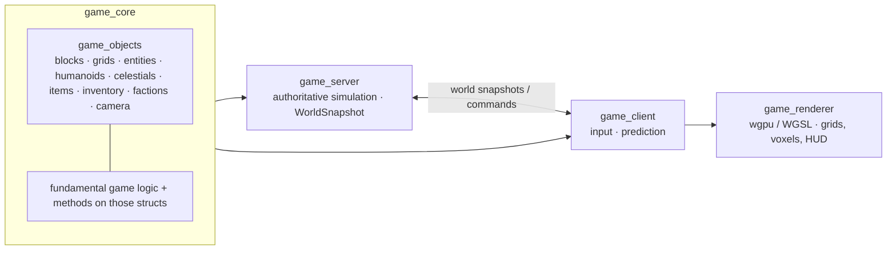

# voxel-space-sandbox

**A Space-Engineers-style voxel engineering sandbox, in Rust.** Build ships and stations
out of grid blocks, mine and reshape destructible voxel planets and asteroids, with
Newtonian physics, power/resources/logistics, structural damage and pressurisation — solo
or on a dedicated server.

[]()
[]()
[](LICENSE)

> Work in progress — this is an engine/game project, not a finished game. See `TODO.md`
> for the current backlog. (Automation/agent notes live in `AGENTS.md`.)

## Architecture



- `game_core` — base data structures, methods on them, and the core rules; contains
  `game_objects` (blocks, grids, entities, humanoids, celestials, items, inventory,
  factions, camera).
- `game_server` — authoritative simulation; produces world snapshots.
- `game_client` — input + (eventually) prediction; talks to the server.
- `game_renderer` — rendering with `wgpu` / WGSL.

## Build & run

```bash
git clone https://github.com/ZZ0R0/voxel-space-sandbox
cd voxel-space-sandbox
cargo run -p game_server        # dedicated server
cargo run -p game_client        # client
```

## Goals

- modular grid-block construction (ships, stations)
- destructible voxel planets/asteroids, mining and terraforming
- Newtonian physics, energy, resources, production, logistics
- structural damage, pressurisation, maintenance
- solo and dedicated-server multiplayer (co-op and PvP)
- scripting/mods for automation and content

## License

[MIT](LICENSE)

---

<sub>Part of my work — more at <a href="https://zz0r0.fr">zz0r0.fr</a>.</sub>
